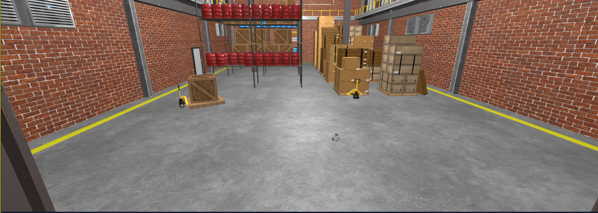
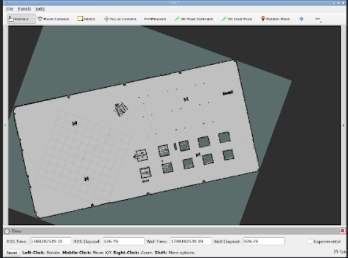
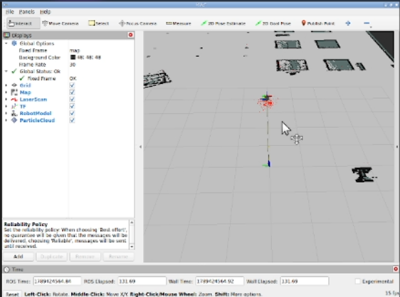
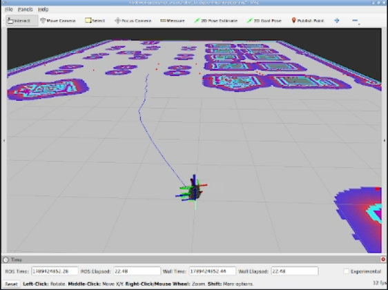
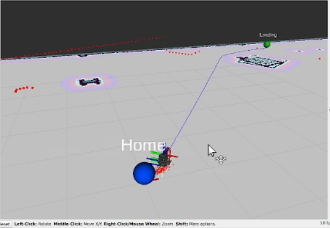
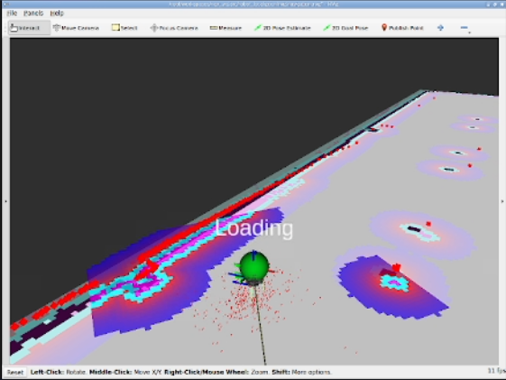
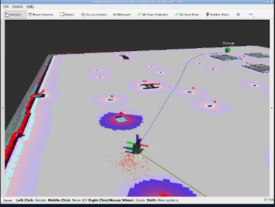
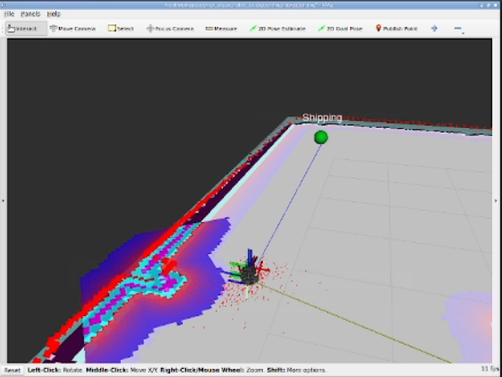

# Autonomous Warehouse Mobile Robot


Autonomous multi-waypoint navigation for a simulated TurtleBot3 Burger in a
Gazebo warehouse, built on ROS 2 Jazzy, SLAM Toolbox, AMCL and Nav2, with a
custom waypoint-mission package that sequences the goals and shows them in RViz2.



## 1. Overview

1. The warehouse is mapped once with **SLAM Toolbox** and the map is saved.
2. **AMCL** localizes the robot on that saved map.
3. **Nav2** plans and drives the robot to goals.
4. **`warehouse_waypoints`** sends a fixed sequence of goals to Nav2 and publishes
   RViz markers (blue = waiting, green = current goal).

```
Gazebo warehouse + TurtleBot3  →  /scan, /odom, /tf
        →  SLAM Toolbox (once)  →  warehouse_map.pgm / .yaml
        →  AMCL (map → odom)  →  Nav2  →  warehouse_waypoints mission
```

## 2. Mission

```
Home → Loading → (wait 30 s) → Storage → Shipping → Home
```

Home is the start pose (AMCL's initial pose is Home) and is only used as the
**final** goal; the first goal sent is Loading. If any goal fails, the mission
aborts and the node exits with code 1.

## 3. Repository structure

```
Autonomous-Warehouse-Mobile-Robot/
├── robot_localizition/            # ament_cmake – Nav2 + AMCL setup (name spelling is intentional)
│   ├── config/
│   │   ├── amcl.yaml
│   │   ├── planner_server.yaml       # planner + GLOBAL costmap
│   │   ├── controller_server.yaml    # DWB controller + LOCAL costmap
│   │   ├── behavior_server.yaml
│   │   └── bt_navigator.yaml
│   ├── launch/
│   │   ├── amcl.launch.py            # map_server + AMCL only
│   │   └── nav2_bringup.launch.py    # map_server + AMCL + full Nav2
│   ├── map/
│   │   ├── warehouse_map.yaml
│   │   └── warehouse_map.pgm
│   ├── rviz/navigation.rviz
│   ├── CMakeLists.txt
│   └── package.xml
│
├── warehouse_waypoints/           # ament_python – mission logic
│   ├── warehouse_waypoints/
│   │   ├── config/waypoints.py          # waypoints, mission order, wait times
│   │   ├── markers/waypoint_marker_publisher.py
│   │   ├── navigation/mission_planner.py
│   │   ├── nodes/waypoint_mission_node.py   # entry point
│   │   └── utils/geometry.py            # yaw → quaternion, Waypoint → PoseStamped
│   ├── test/
│   ├── resource/
│   ├── package.xml
│   ├── setup.py
│   └── setup.cfg
│
├── image/                         # screenshots used in this README
├── LICENSE
└── README.md
```

> **Not included in this repo:** the Gazebo warehouse world and the
> `turtlebot3_burger_cam` robot spawn. They come from a separate simulation
> package that you launch yourself (see Section 6).

## 4. Requirements

- ROS 2 Jazzy and Gazebo Harmonic
- Nav2: `nav2_bringup`, `nav2_amcl`, `nav2_map_server`, `nav2_planner`,
  `nav2_controller`, `nav2_behaviors`, `nav2_bt_navigator`,
  `nav2_lifecycle_manager`, `nav2_simple_commander`
- `dwb_core` (local planner) and `nav2_navfn_planner` (global planner) – installed with Nav2
- SLAM Toolbox (only needed to re-map the warehouse)
- TurtleBot3 packages / a simulation package that provides the Gazebo warehouse and
  the `turtlebot3_burger_cam` model
- `rviz2`, Python 3, `rclpy`

## 5. Build

Clone into the `src/` folder of your workspace (for example `~/workspaces/nav_ws`):

```bash
cd ~/workspaces/nav_ws/src
git clone https://github.com/mohamedelnahas2004/Autonomous-Warehouse-Mobile-Robot.git

cd ~/workspaces/nav_ws
source /opt/ros/jazzy/setup.bash
colcon build --symlink-install --packages-select robot_localizition warehouse_waypoints
source install/setup.bash
```

Check that both packages are found:

```bash
ros2 pkg list | grep -E "robot_localizition|warehouse_waypoints"
```

Rebuild after changing a `package.xml`, `setup.py`, `CMakeLists.txt`, launch files,
installed config/map files, or entry points.

## 6. Run the full mission

Source ROS and your workspace in every terminal:

```bash
source /opt/ros/jazzy/setup.bash
source ~/workspaces/nav_ws/install/setup.bash
```

| Terminal | What | Command |
|---|---|---|
| 1 | Gazebo warehouse + TurtleBot3 (from your simulation package, **not in this repo**) | `ros2 launch <your_simulation_package> <your_warehouse_launch_file>` |
| 2 | Map server, AMCL, Nav2 | `ros2 launch robot_localizition nav2_bringup.launch.py` |
| 3 | RViz2 | `rviz2 -d $(ros2 pkg prefix robot_localizition)/share/robot_localizition/rviz/navigation.rviz` |
| 4 | Mission | `ros2 run warehouse_waypoints waypoint_mission_node` |

Notes:

- `amcl.yaml` sets the initial pose to `(0, 0, 0)` (`set_initial_pose: true`), which is
  **Home**, so the robot should spawn at Home. If it does not, set the pose with
  **2D Pose Estimate** in RViz and wait for the particle cloud to converge before
  starting the mission.
- The mission node calls `waitUntilNav2Active()`, so it waits for AMCL and the BT
  navigator to be active before sending the first goal.
- To run localization only (no planner/controller): `ros2 launch robot_localizition amcl.launch.py`.

### Expected mission log

```
[waypoint_mission_node]: Setting 'Loading' as active goal.
[waypoint_mission_node]: Reached 'Loading'.
[waypoint_mission_node]: Waiting 30s at 'Loading'...
[waypoint_mission_node]: Setting 'Storage' as active goal.
[waypoint_mission_node]: Reached 'Storage'.
[waypoint_mission_node]: Setting 'Shipping' as active goal.
[waypoint_mission_node]: Reached 'Shipping'.
[waypoint_mission_node]: Setting 'Home' as active goal.
[waypoint_mission_node]: Reached 'Home'.
[waypoint_mission_node]: Mission complete. Robot returned Home.
```

On failure: `Failed to reach '<name>' (Nav2 result: ...). Aborting mission.`

## 7. Map

`robot_localizition/map/warehouse_map.yaml`:

| Field | Value |
|---|---|
| image | `warehouse_map.pgm` (614 × 310 px) |
| resolution | 0.05 m/px (≈ 30.7 m × 15.5 m) |
| origin | `[-8.515, -6.682, 0]` |
| occupied / free threshold | 0.65 / 0.196 |

All four waypoints fall on free cells of this map.

### Re-mapping with SLAM Toolbox

SLAM Toolbox **builds** the map; AMCL only **localizes** on an already saved map.

```bash
ros2 launch slam_toolbox online_async_launch.py use_sim_time:=true   # or your own SLAM Toolbox launch file
rviz2                                                                  # Fixed Frame = map; add Map, LaserScan, TF, RobotModel
```

Drive the robot around the whole warehouse, then save and copy the map:

```bash
ros2 run nav2_map_server map_saver_cli -f warehouse_map --ros-args -p save_map_timeout:=10000.0
cp warehouse_map.yaml warehouse_map.pgm ~/workspaces/nav_ws/src/Autonomous-Warehouse-Mobile-Robot/robot_localizition/map/
```

Rebuild afterwards. If you re-map, re-check the waypoint coordinates (Section 9) against the new map.



## 8. Navigation stack configuration

All values below are taken from the YAML files in `robot_localizition/config/`
(tuned for the TurtleBot3 Burger, `use_sim_time: true`).

**AMCL** (`amcl.yaml`)

| Parameter | Value |
|---|---|
| Frames | `base_footprint`, `map`, `odom` |
| Motion model | `nav2_amcl::DifferentialMotionModel` |
| Particles | 500 – 2000 (`pf_err` 0.05, `pf_z` 0.99) |
| Laser model | `likelihood_field`, `max_beams` 60, `laser_max_range` 12.0 m |
| Update thresholds | `update_min_d` 0.25 m, `update_min_a` 0.2 rad |
| Initial pose | `(0, 0, 0)` |

**Planning and control**

| Component | File | Setup |
|---|---|---|
| Global planner | `planner_server.yaml` | `NavfnPlanner` (Dijkstra, `use_astar: false`), tolerance 0.5 m, `allow_unknown: true` |
| Global costmap | `planner_server.yaml` | frame `map`, layers: static, obstacle, denoise, inflation; `robot_radius` 0.1 |
| Local controller | `controller_server.yaml` | `DWBLocalPlanner` at 10 Hz, max 0.22 m/s linear, 1.0 rad/s angular |
| Goal checker | `controller_server.yaml` | `xy_goal_tolerance` 0.25 m, `yaw_goal_tolerance` 0.25 rad |
| Local costmap | `controller_server.yaml` | frame `odom`, rolling window 3 × 3 m, layers: obstacle, denoise, inflation |
| Inflation (both) | — | radius 0.5 m, cost scaling 5.0 |
| Behaviors | `behavior_server.yaml` | spin, backup, drive_on_heading, wait, assisted_teleop |
| BT Navigator | `bt_navigator.yaml` | `navigate_to_pose`, `navigate_through_poses` |

`nav2_bringup.launch.py` starts `map_server`, `amcl`, `planner_server`,
`controller_server`, `behavior_server`, `bt_navigator` and a lifecycle manager that
activates them. Plain `Twist` is used on `/cmd_vel` (`enable_stamped_cmd_vel: false`).




## 9. Waypoints

Defined only in `warehouse_waypoints/warehouse_waypoints/config/waypoints.py`
(map frame):

| Waypoint | x (m) | y (m) | yaw (rad) |
|---|---|---|---|
| Home | 0.0 | 0.0 | 0.0 |
| Loading | 7.782054 | 7.420773 | 0.0 |
| Storage | 20.000935 | -2.415623 | -1.5708 |
| Shipping | -5.930928 | -5.406363 | 3.1416 |

```python
MISSION_ORDER = ['Loading', 'Storage', 'Shipping', 'Home']
WAIT_DURATIONS_SEC = {'Loading': 30.0}
```

Orientation is stored as yaw and converted with `qz = sin(yaw/2)`, `qw = cos(yaw/2)`
(planar navigation). The yaw values are provisional and have not been checked against
the physical layout of the warehouse. To record a real pose at a station, run
`ros2 topic echo /amcl_pose --once`.

### Code structure

| Module | Responsibility |
|---|---|
| `config/waypoints.py` | Data only: waypoints, mission order, wait durations |
| `markers/waypoint_marker_publisher.py` | Builds and publishes the `MarkerArray` on `/waypoint_markers` |
| `navigation/mission_planner.py` | Sends goals through Nav2 `BasicNavigator`, waits for results, handles the 30 s wait |
| `nodes/waypoint_mission_node.py` | Entry point (`waypoint_mission_node`): wires everything and runs the mission once |
| `utils/geometry.py` | Yaw → quaternion and `Waypoint` → `PoseStamped` |

## 10. RViz

Config: `robot_localizition/rviz/navigation.rviz`, Fixed Frame `map`.

| Display | Topic |
|---|---|
| Map | `/map` |
| RobotModel | `/robot_description` |
| LaserScan | `/scan` |
| Global Costmap | `/global_costmap/costmap` |
| Local Costmap | `/local_costmap/costmap` |
| Global Plan | `/plan` |
| Local Plan | `/local_plan` |
| ParticleCloud | `/particle_cloud` |
| Waypoints (MarkerArray) | `/waypoint_markers` |

Plus Grid and TF. Tools: 2D Pose Estimate, 2D Goal Pose, Publish Point.

Waypoint markers: **blue** = waypoint not active, **green** = current goal. They are
published by the mission node, so they appear only after the node has started and
Nav2 is active.






## 11. Tests

```bash
cd ~/workspaces/nav_ws
colcon test --packages-select warehouse_waypoints
colcon test-result --verbose
```

Included: three unit tests for the marker colors (`test_waypoint_marker_publisher.py`)
plus the standard ament copyright, flake8 and pep257 checks.

## 12. Troubleshooting

- **Markers not visible in RViz** – check the mission node is running, then
  `ros2 topic echo /waypoint_markers`, and make sure RViz has a `MarkerArray` display on
  that topic with Fixed Frame `map`.
- **Nav2 never becomes active / mission waits forever** – check AMCL has a pose
  (set the initial pose) and `ros2 lifecycle get /amcl`, `/bt_navigator`.
- **Check TF** – `ros2 run tf2_ros tf2_echo map base_footprint`, or
  `ros2 run tf2_tools view_frames`.
- **Do not put a `package.xml` / `CMakeLists.txt` at the repo or workspace root** –
  colcon would treat the root as a package and fail on missing `launch/` folders.
- **`cp: cannot stat ...` when copying map files** – the source path does not exist;
  `ls` it first.
- **Package name errors** – package names and installed executable names must stay
  consistent, or `ros2 run` / `ros2 launch` cannot find them. Keep the
  `robot_localizition` spelling.

## 13. Demo video

[Watch the demonstration](https://drive.google.com/file/d/16PXEJtR36JUpgdENpoLA09O_U8T13w_F/view?usp=sharing)

## 14. Known limitations / future work

- The Gazebo warehouse launch is outside this repo; document or add the package.
- Waypoint yaw values need to be verified against the real layout.
- No unit tests yet for `mission_planner.py` (only the marker publisher is tested).
- The mission runs once and aborts on the first failed goal (no retry).
- Package metadata (`description`, `maintainer`, `license`) in both `package.xml` files
  still contains placeholders.

## License

MIT – see [LICENSE](LICENSE).

